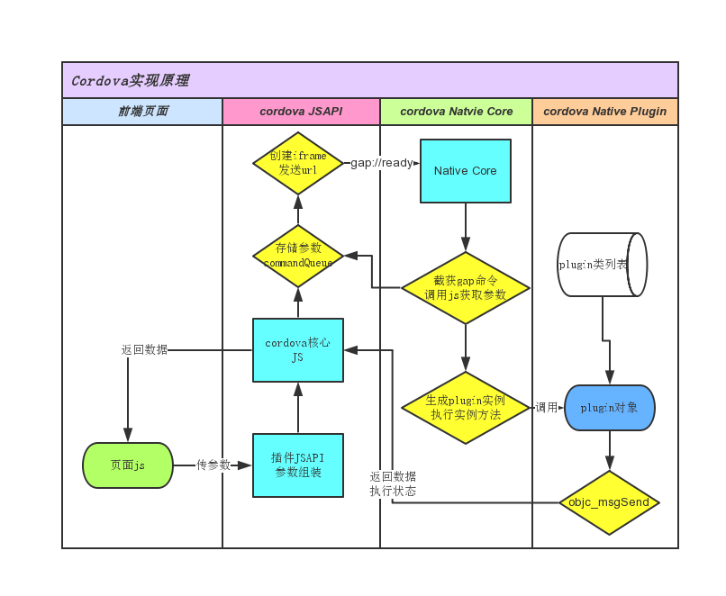
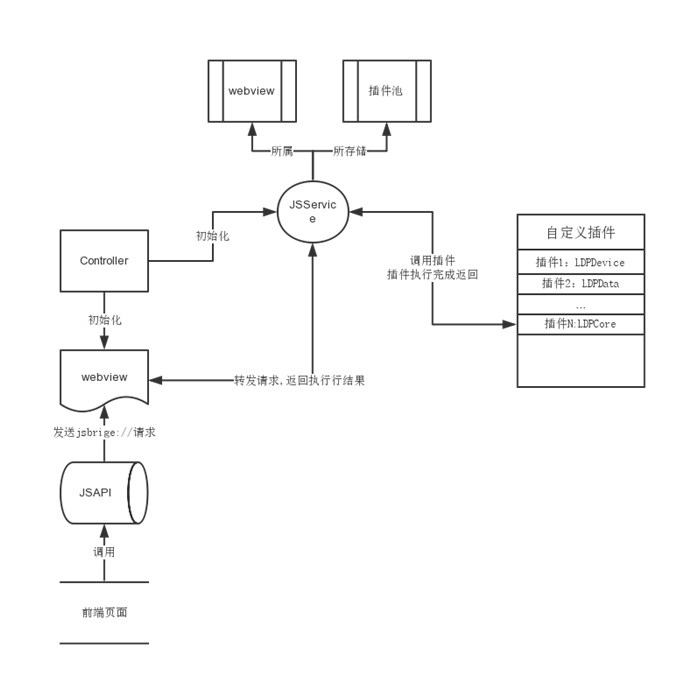

# LDJSBridge_IOS
===============

>**LDJSBridge_IOS**的核心目标是完成在IOS客户端中**WAP页面和客户端（Native）的深度交互**。 


## 如何集成LDJSBridge_IOS
-------------------
强烈推荐采用Pod集成：在项目工程的Podfile文件中加载LDJSBridge库：

```
pod 'LDJSBridge' :git => 'https://github.com/Lede-Inc/LDJSBridge_IOS.git'
```


## LDJSBridge_IOS的插件运行机制

>
本LDJSBridge_IOS是基于Phonegap的Cordova引擎的基础上简化而来，其基本原理参照Cordova的引擎原理如图所示：




>
在Cordova的基础上我们进行了简化，通过JSAPIService服务的方式进行插件扩展开发如图所示：



## 如何开发基于LDJSBridge_IOS的Native插件
-------------------------------------

### 定义某个模块插件

在Native部分，定义一个模块插件对应于创建一个插件类, 模块中的每个插件接口对应插件类中某个方法。
集成LDJSBridge_IOS框架之后，只需要继承框架中的插件基类LDJSPlugin，如下所示：


* 插件接口定义

```
	#import "LDJSPlugin.h"
	@interface LDPDevice : LDJSPlugin
	{}

	//@func 获取设备信息
	- (void)getDeviceInfo:(LDJSInvokedUrlCommand*)command;
	
	@end
```
	
* LDJSPlugin 属性方法说明

```
	//在bridgeService中提供对webview和controller的访问
	@property (weak, nonatomic) LDJSService *bridgeService;
	@property (assign, nonatomic) UIViewController *viewController;
	@property (assign, nonatomic) UIWebView *webView;
	@property (assign, nonatomic) id<LDJSCommandDelegate> commandDelegate;
	@property (assign, nonatomic) BOOL isReady;
```


* 自定义插件接口实现

```
	@implementation LDPDevice
	//@func 获取设备信息
	- (void)getDeviceInfo:(LDJSInvokedUrlCommand*)command{
		//从comment中获取参数，
		//arg参数（通过p参数传递的非JSONObject），
		//json参数 通过p传递的JSONObject
		//arg参数通过index获取，json对象参数通过key获取
		
	
   		//读取设备信息
   		NSMutableDictionary* deviceProperties = [NSMutableDictionary dictionaryWithCapacity:4];
   		UIDevice* device = [UIDevice currentDevice];
   		[deviceProperties setObject:[device systemName] forKey:@"systemName"];
   		[deviceProperties setObject:[device systemVersion] forKey:@"systemVersion"];
   		[deviceProperties setObject:[device model] forKey:@"model"];
   		[deviceProperties setObject:[device modelVersion] forKey:@"modelVersion"];
   		[deviceProperties setObject:[self uniqueAppInstanceIdentifier] forKey:@"identifier"];
   
   		//对接口方法获取的结果进行封装，message可以封装dic、array、strng、int等类型的数据
   		LDJSPluginResult* pluginResult = [LDJSPluginResult resultWithStatus:CDVCommandStatus_OK messageAsDictionary:[NSDictionary dictionaryWithDictionary:deviceProperties]];
   
   		//通过delegate将结果 传回 webview进行处理
   		[self.commandDelegate sendPluginResult:pluginResult callbackId:command.callbackId];
	}
```


## 如何在WebView页面使用自定义的插件
---------------------------------

 在IOS项目中，当展示WAP页面的时候会用到UIWebView组件，我们通过在UIWebView组件所在的Controller中注册JSAPIServie服务，拦截Webview的URL进行处理。
 
 * 在Webview所在的Controller中初始化一个JSAPIService，并注册该WebView需要使用的插件
 
 ```
 	//注册插件Service
    if (_bridgeService == nil) {
        _bridgeService = [[LDJSService alloc] initBridgeServiceWithConfig:@"PluginConfig.json"];
    }
    
    [_bridgeService connect:_webview Controller:self];
 ```
 
 PluginConfig.json文件主要是对JSAPI的插件进行配置，如下所示：
 
 update: 配置在线更新核心JS文件的url
 
 plugins：配置每个插件对应的JS调用名称和类名；exports如果不配置，则类中的方法则为JS调用函数；
 
```
	{
    "update": "",
    "plugins": [
        {
            "pluginname": "device",
            "pluginclass": "LDPDevice",
            "exports": [
                {
                    "showmethod": "getDeviceInfo",
                    "realmethod": "getDeviceInfo"
                }
            ]
        },
        {
            "pluginname": "app",
            "pluginclass": "LDPAppInfo",
            "exports": []
        },
        {
            "pluginname": "nav",
            "pluginclass": "LDPUINavCtrl",
            "exports": []
        },
        {
            "pluginname": "ui",
            "pluginclass": "LDPUIGlobalCtrl",
            "exports": []
        }
    ]
}
```
 
 
 
 
 * 当WebView加载JSAPI完成之后，可以通过Event事件通知前端页面：
 
 ```
	 /**
	 Called when the webview finishes loading.  This stops the activity view.
	 */
	- (void)webViewDidFinishLoad:(UIWebView *)theWebView
	{
	    NSLog(@"Finished load of: %@", theWebView.request.URL);
	    //当webview finish load之后，发event事件通知前端JSBridgeService已经就绪
	    //监听事件由各个产品自行决定
	    [_bridgeService readyWithEvent:@"LDJSBridgeServiceReady"];
	}
 ```


## 定义NavigationController导航的Wap功能模块
-------------------------------------------

在手机qq里可以看到很多独立的基于WAP页面的功能模块，其实基于JSBridge的JSAPI最大的用处是以这种方式呈现。

* 目前在demo工程中已经初步完成了Device、App、UI导航部分的示例（参看[LDPBaseWebViewCrtl.m 文件](CommonJSAPI/LDPBaseWebViewCrtl.m)），客户端可以在此基础上根据项目需求进行完善开发：
		

## 技术支持
-------------------

>
to be continued ....


庞辉, 电商技术中心，popo：__huipang@corp.netease.com__
